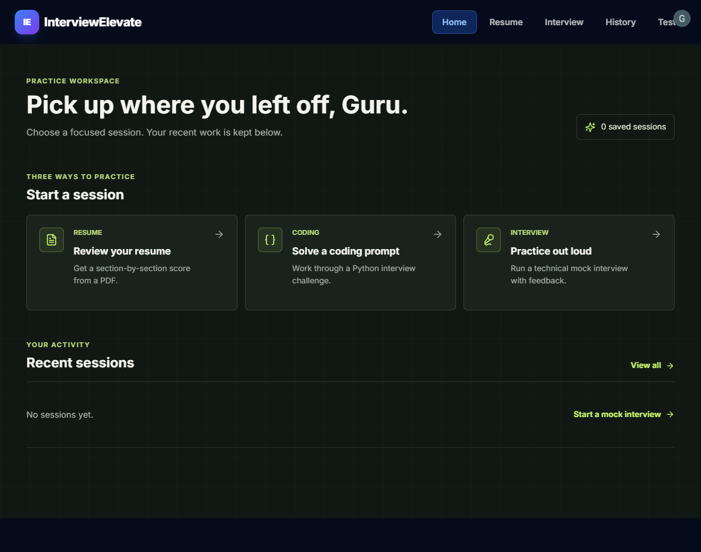
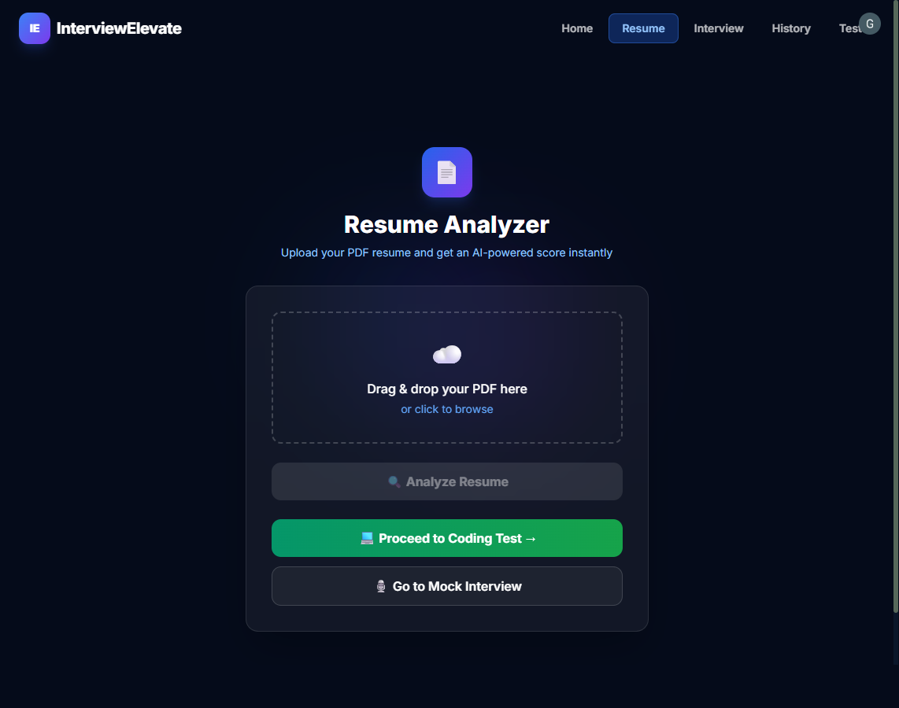

# 🎯 InterviewElevate — AI-Powered Interview Preparation Platform

<div align="center">


**Where Preparation Meets AI-Driven Insight**

[📺 Demo](#demo) · [🚀 Quick Start](#quick-start) · [📖 Features](#features) · [🛠️ Tech Stack](#tech-stack) · [🤝 Contributing](#contributing)

</div>

---

## 📋 Overview

**InterviewElevate** is a full-stack AI-powered interview preparation platform that combines:

- 📄 **Resume Analysis** — extracts PDF text and scores key resume sections
- 💻 **Python Coding Challenges** — Monaco editor with hidden-test execution via Docker
- 🎙️ **AI Mock Interviews** — Dynamic questions via Cohere AI + Web Speech API
- 📈 **Personalized Feedback** — Scores and targeted suggestions after each session
- 📜 **Session History** — Track all your interview sessions over time

---

## ✨ Features

| Feature | Description |
|---|---|
| 🔐 **Auth** | Clerk-based authentication (sign up / sign in) |
| 📄 **Resume Scorer** | Uploads PDF, extracts sections, gives a 0–100 score |
| 💻 **Coding Test** | Python-only Monaco IDE; hidden-test execution is disabled on the hosted demo because the managed host has no Docker daemon |
| 🎙️ **Mock Interview** | 5-round AI interview with speech recognition + TTS |
| 📊 **Evaluation** | Cohere AI feedback on code and interview answers |
| 💡 **Code Hints** | AI-powered syntax hints while coding |
| 📜 **History** | SQLite-backed session history per user |
| 🌗 **Dark UI** | Premium dark-mode design with glassmorphism |

---

## 🛠️ Tech Stack

### Frontend
| Technology | Purpose |
|---|---|
| React 18 | UI framework |
| Tailwind CSS | Styling |
| @clerk/clerk-react | Authentication |
| @monaco-editor/react | Code editor |
| react-webcam | Webcam feed |
| react-router-dom | Client routing |
| Axios | HTTP client |
| Split.js | Resizable panels |

### Backend
| Technology | Purpose |
|---|---|
| FastAPI | REST API framework |
| Uvicorn | ASGI server |
| Cohere AI | LLM (question generation, evaluation, hints) |
| PyMuPDF (fitz) | PDF text extraction |
| NLTK | Text processing |
| Docker SDK | Code execution sandboxing |
| SQLite | Session history storage |
| Python-dotenv | Environment management |

---

## 📁 Project Structure

```
ai_interview_app/
├── backend/                  # FastAPI backend
│   ├── main.py               # All API routes
│   ├── requirements.txt      # Python dependencies
│   └── models.py             # DB models
├── frontend/                 # React frontend
│   ├── src/
│   │   ├── pages/
│   │   │   ├── Home.js       # Landing page
│   │   │   ├── ResumeUpload.js
│   │   │   ├── TestPage.js   # Coding challenge
│   │   │   ├── interview.js  # Mock interview
│   │   │   └── history.js   # Session history
│   │   ├── components/
│   │   │   └── Navbar.js
│   │   └── Api.js            # Axios config
│   └── package.json
├── interview_module/          # Interview AI logic
│   ├── interview_question_generatr.py
│   └── evaluator.py
├── test_evaluator/            # Coding test logic
│   ├── questions.py
│   ├── evaluate.py
│   ├── hint_generator.py
│   └── docker_runner.py
├── resume_module/             # Resume parsing & scoring
│   ├── scorer.py
│   └── functions.py
├── d_id/                      # D-ID avatar integration (optional)
│   └── client.py
├── history.db                 # SQLite database (auto-created)
└── .env                       # API keys (not committed)
```

---

## 🚀 Quick Start

### Prerequisites

- **Python 3.10+**
- **Node.js 18+**
- **Docker Desktop** (optional; required only for running coding tests)
- **Cohere API key** → [Get one free](https://cohere.com/)
- **Clerk account** → [clerk.com](https://clerk.com/)

---

### 1. Clone the Repository

```bash
git clone https://github.com/ItzGuruKiranV/ai_interview_app.git
cd ai_interview_app
```

---

### 2. Configure Environment Variables

Create/edit the `.env` file at the **project root**:

```env
COHERE_API_KEY=your_cohere_api_key_here
DID_API_KEY=your_did_api_key_here   # Optional - for avatar feature
```

Create/edit `frontend/.env`:

```env
REACT_APP_CLERK_PUBLISHABLE_KEY=your_clerk_publishable_key_here
```

---

### 3. Set Up the Backend

```bash
# Run these commands from the repository root
python -m venv backend/venv
backend\venv\Scripts\activate      # Windows
# source backend/venv/bin/activate  # macOS/Linux

# Install dependencies
python -m pip install -r backend/requirements.txt

# Start the FastAPI server
python -m uvicorn backend.main:app --reload --port 8000
```

The backend will be available at: **http://localhost:8000**

API docs: **http://localhost:8000/docs**

---

### 4. Set Up the Frontend

```bash
cd frontend
npm install
npm start
```

The frontend is usually available at **http://localhost:3000**. If that port is occupied, Create React App offers the next available port.

---

## Public Demo Deployment (Render)

**Live demo:** [InterviewElevate](https://interview-elevate-frontend.onrender.com/)

The repository includes a `render.yaml` Blueprint for a React static site and FastAPI service. To deploy it:

1. Push the project to GitHub, then sign in to [Render](https://dashboard.render.com/) with GitHub.
2. Select **New + → Blueprint**, choose this repository and the `main` branch, and apply the Blueprint.
3. Enter the prompted values in Render. Keep all secret values in Render, never in Git:
  - `COHERE_API_KEY`: your Cohere API key.
  - `REACT_APP_CLERK_PUBLISHABLE_KEY`: the Clerk publishable key for the hosted app.
  - `CLERK_ISSUER` and `CLERK_JWKS_URL`: the issuer and JWKS endpoint for that Clerk instance.
4. In Clerk, allow the generated frontend `onrender.com` URL as an application origin and redirect URL. Use the matching Clerk production configuration for a public deployment.
5. Wait for both services to deploy. Render assigns public `onrender.com` URLs; the frontend uses the configured API service URL.

The hosted API requires a valid Clerk session token. The Blueprint disables Docker-based code execution, and its SQLite database is temporary, so saved history may be cleared when the API service restarts or redeploys. Persistent history and public code execution require additional infrastructure and security work. Render's free web service may sleep when idle.

For a custom domain, first deploy and verify the generated Render URL, then add a domain you own in the Render service settings and follow its DNS instructions. A custom domain is optional; the generated URL is already shareable.

---

### 5. (Optional) Set Up Docker for Code Execution

The coding test supports Python and runs submissions in a Docker sandbox. Pull the Python image:

```bash
docker pull python:3.9
```

> Docker is required for the coding test's hidden-test runner. Resume analysis, interview practice, and history do not require Docker.

---

## 📡 API Endpoints

| Method | Endpoint | Description |
|--------|----------|-------------|
| `GET` | `/` | Health check |
| `POST` | `/register` | Register a user |
| `GET` | `/history` | Get user session history |
| `POST` | `/save-history` | Save a session result |
| `GET` | `/get-question` | Generate coding question |
| `POST` | `/evaluate-answer` | Evaluate submitted code |
| `POST` | `/code-hint` | Get syntax hint |
| `POST` | `/run-tests` | Run hidden test cases (Docker) |
| `POST` | `/interview-question` | Generate next interview question |
| `POST` | `/interview-evaluate` | Evaluate full interview session |
| `POST` | `/resume-upload` | Upload and score a resume |
| `POST` | `/did-avatar` | Generate D-ID avatar video (optional) |

---

## 🔑 Getting API Keys

### Cohere AI (Required)
1. Visit [cohere.com](https://cohere.com/)
2. Sign up for a free account
3. Go to Dashboard → API Keys
4. Copy your key to `.env` as `COHERE_API_KEY`

### Clerk (Required for Authentication)
1. Create a Clerk application and copy its publishable key to `frontend/.env` as `REACT_APP_CLERK_PUBLISHABLE_KEY`.
2. In Clerk's authentication settings, enable **Phone number** sign-in and **verification code** as the phone verification method. Configure SMS delivery for the Clerk instance.
3. Enable **Email address** and **Password** as well if you want to use the shared demo account.
4. In the Clerk dashboard, create a demo user with email `guru@gmail.com` and password `Guru@123`. Complete any required email verification for that user.
5. Add your local or deployed frontend URL to Clerk's allowed origins and redirect URLs.

The demo credentials are public and shared by anyone using the repository. Do not save personal information or resumes in that account; users of the shared account can see the same session history. Phone OTP appears in the Clerk sign-in UI only after the Clerk dashboard settings and SMS delivery are enabled.

### D-ID (Optional — for AI Avatar)
1. Visit [d-id.com](https://www.d-id.com/)
2. Sign up and get an API key
3. Copy to `.env` as `DID_API_KEY`

---

## 🎮 How to Use

```
1. Sign up / Sign in with Clerk auth
2. Upload your PDF resume → Get an AI score
3. Click "Proceed to Coding Test" → Solve a coding problem
4. Click "Go to Mock Interview" → Answer 5 AI questions via voice
5. View your session history in the History tab
```

---

## 🐛 Known Issues & Troubleshooting

| Issue | Fix |
|-------|-----|
| Resume score is 0 | Make sure your PDF has selectable text (not a scanned image) |
| Speech recognition not working | Use **Google Chrome** — Web Speech API is not supported in all browsers |
| Code execution fails | Make sure **Docker** is running and `python:3.9` image is pulled |
| CORS errors | Make sure the backend is running on port 8000; local frontend ports are allowed |
| `COHERE_API_KEY` missing error | Check your root `.env` file has the key spelled correctly |

---

## Screenshots

### Practice Dashboard



### Resume Review



---

## 🤝 Contributing

Contributions are welcome! Please:

1. Fork the repository
2. Create a feature branch: `git checkout -b feature/amazing-feature`
3. Commit your changes: `git commit -m 'Add amazing feature'`
4. Push to branch: `git push origin feature/amazing-feature`
5. Open a Pull Request

---

## 👥 Team

**Team IntelliPrep** — Department of Computer Science

| Name | GitHub |
|------|--------|
| Guru Kiran | [@ItzGuruKiranV](https://github.com/ItzGuruKiranV) |

---

## 📄 License

This project is licensed under the **MIT License** — see the [LICENSE](LICENSE) file for details.

---

## ⭐ Acknowledgements

- [Cohere AI](https://cohere.com/) — for the LLM API powering question generation and evaluation
- [Clerk](https://clerk.com/) — for seamless authentication
- [Monaco Editor](https://microsoft.github.io/monaco-editor/) — for the code editor
- [D-ID](https://www.d-id.com/) — for the AI avatar feature
- [FastAPI](https://fastapi.tiangolo.com/) — for the blazing-fast backend

---

<div align="center">
  Made with ❤️ by Team IntelliPrep
  <br/>
  <a href="https://github.com/ItzGuruKiranV/ai_interview_app">⭐ Star this repo if it helped you!</a>
</div>
